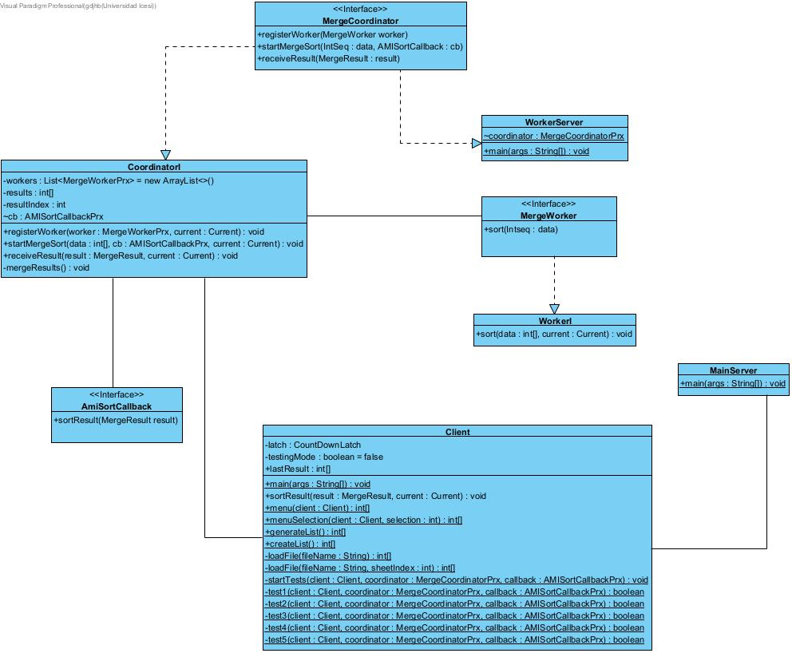

# Reporte de análisis

Este documento contiene un resumen del proceso de planeación, diseño, desarrollo y pruebas de la implementación de un algoritmo de ordenamiento distribuido utilizando llamadas asíncronas en el contexto de ICE (Internet Communications Engine).

## Estrategia de Distribución

El algoritmo de Ordenamiento usado es el algoritmo por Mezcla (**Merge Sort**), que se caracteriza por su naturaleza divisible y facilidad para ser paralelizado. La estrategia empleada consiste en tener un servidor principal (**main-server**) el cual se encarga de recibir y dividir el conjunto de datos inicial en partes iguales, para luego enviar el conjunto de datos entre los nodos disponibles en la red (**worker-server**), de modo que cada nodo pueda ordenar su parte del conjunto de datos de manera local utilizando el algoritmo de Ordenamiento por Mezcla.

Los nodos trabajadores irán enviando los resultados de manera asíncrona a medida que estos terminen de organizar los conjuntos de datos que se les asignaron.

Cuando se hayan combinado todos los resultados parciales, el servidor principal tendrá el conjunto completo ordenado y enviara los resultados al cliente.

## Diseño de la implementación

La implementación sigue una arquitectura cliente-servidor distribuida, donde el servidor principal (MainServer) coordina el proceso de ordenamiento paralelo utilizando múltiples servidores trabajadores (WorkerServer). El servidor principal divide el conjunto de datos en porciones iguales y envía cada porción a un servidor trabajador disponible. Cada servidor trabajador ordena su porción utilizando el algoritmo de ordenamiento. Una vez que todos los servidores trabajadores han completado su tarea, el servidor principal combina los resultados parciales utilizando una operación de mezcla paralela y envía el resultado final al cliente.



## Pruebas y resultados

Se realizaron pruebas con diferentes conjuntos de datos, incluyendo casos extremos como listas vacías, listas con un solo elemento, listas desordenadas, listas ordenadas y listas con elementos repetidos. Además, se ejecutaron las pruebas con diferentes cantidades de nodos trabajadores (2, 5 y 10 nodos) para evaluar el impacto del paralelismo en el rendimiento. 

A continuación, se muestran algunos resultados impresos por el algoritmo:

### Número de trabajadores: 2

```
Test 1: Test for empty list

Sent data: []
Received sorted data: []
Lasted: 7221100 nanoseconds

Test 1: passed.
```

```
Test 2: Test for list with one element

Sent data: [1]
Received sorted data: [1]
Lasted: 2156300 nanoseconds

Test 2: passed.
```

```
Test 3: Test for unsorted list

Sent data: [1, 2, 3, 4, 4, 6, 1, 2, 2, 41, 42, 52, 5, 4, 14, 14, 2, 3, 4, 4, 2, 2, 5, 23, 2, 3, 22, 5, 7, 4, 3, 4, 5, 83, 2, 3, 4, 5, 2, 3, 7, 9, 5, 2, 3, 1, 6, 3, 8, 55]
Received sorted data: [1, 1, 1, 2, 2, 2, 2, 2, 2, 2, 2, 2, 2, 3, 3, 3, 3, 3, 3, 3, 3, 4, 4, 4, 4, 4, 4, 4, 4, 5, 5, 5, 5, 5, 5, 6, 6, 7, 7, 8, 9, 14, 14, 22, 23, 41, 42, 52, 55, 83]
Lasted: 3456900 nanoseconds

Test 3: passed.
```

```
Test 4: Test for sorted list

Sent data: [1, 2, 3, 4, 5, 6, 7, 8, 9, 10, 11, 12, 13, 14, 15, 16, 17, 18, 19, 20, 21, 22, 23, 24, 25, 26, 27, 28, 29, 30, 31, 32, 33, 34, 35, 36, 37, 38, 39, 40, 41, 42, 43, 44, 45, 46, 47, 48, 49, 50]
Received sorted data: [1, 2, 3, 4, 5, 6, 7, 8, 9, 10, 11, 12, 13, 14, 15, 16, 17, 18, 19, 20, 21, 22, 23, 24, 25, 26, 27, 28, 29, 30, 31, 32, 33, 34, 35, 36, 37, 38, 39, 40, 41, 42, 43, 44, 45, 46, 47, 48, 49, 50]
Lasted: 13997800 nanoseconds

Test 4: passed.
```

```
Test 5: Test for a list with repeated elements

Sent data: [3, 3, 3, 3, 3, 3, 3, 3, 3, 1]
Received sorted data: [1, 3, 3, 3, 3, 3, 3, 3, 3, 3]
Lasted: 10721500 nanoseconds

Test 5: passed.
```

### Número de trabajadores: 5

```
Test 1: Test for empty list

Sent data: []
Received sorted data: []
Lasted: 8166600 nanoseconds

Test 1: passed.
```

```
Test 2: Test for list with one element

Sent data: [1]
Received sorted data: [1]
Lasted: 2130600 nanoseconds

Test 2: passed.
```

```
Test 3: Test for unsorted list

Sent data: [1, 2, 3, 4, 4, 6, 1, 2, 2, 41, 42, 52, 5, 4, 14, 14, 2, 3, 4, 4, 2, 2, 5, 23, 2, 3, 22, 5, 7, 4, 3, 4, 5, 83, 2, 3, 4, 5, 2, 3, 7, 9, 5, 2, 3, 1, 6, 3, 8, 55]
Received sorted data: [1, 1, 1, 2, 2, 2, 2, 2, 2, 2, 2, 2, 2, 3, 3, 3, 3, 3, 3, 3, 3, 4, 4, 4, 4, 4, 4, 4, 4, 5, 5, 5, 5, 5, 5, 6, 6, 7, 7, 8, 9, 14, 14, 22, 23, 41, 42, 52, 55, 83]
Lasted: 2933300 nanoseconds

Test 3: passed.
```

```
Test 4: Test for sorted list

Sent data: [1, 2, 3, 4, 5, 6, 7, 8, 9, 10, 11, 12, 13, 14, 15, 16, 17, 18, 19, 20, 21, 22, 23, 24, 25, 26, 27, 28, 29, 30, 31, 32, 33, 34, 35, 36, 37, 38, 39, 40, 41, 42, 43, 44, 45, 46, 47, 48, 49, 50]
Received sorted data: [1, 2, 3, 4, 5, 6, 7, 8, 9, 10, 11, 12, 13, 14, 15, 16, 17, 18, 19, 20, 21, 22, 23, 24, 25, 26, 27, 28, 29, 30, 31, 32, 33, 34, 35, 36, 37, 38, 39, 40, 41, 42, 43, 44, 45, 46, 47, 48, 49, 50]
Lasted: 2316900 nanoseconds

Test 4: passed.
```

```
Test 5: Test for a list with repeated elements

Sent data: [3, 3, 3, 3, 3, 3, 3, 3, 3, 1]
Received sorted data: [1, 3, 3, 3, 3, 3, 3, 3, 3, 3]
Lasted: 2664600 nanoseconds

Test 5: passed.
```

Todas las pruebas se ejecutaron correctamente, lo que demuestra la solidez de la implementación.

## Análisis de rendimiento

### Complejidad

El algoritmo de ordenamiento utilizado en cada servidor trabajador es Arrays.parallelSort(), que es una implementación paralela del algoritmo de ordenamiento por mezcla (Merge Sort). Este algoritmo tiene una complejidad temporal promedio de O(n log n), donde n es el tamaño del conjunto de datos.

Sin embargo, al dividir el conjunto de datos entre múltiples servidores trabajadores, la complejidad temporal efectiva se reduce a O((n/k) log (n/k)), donde k es el número de servidores trabajadores. Esto se debe a que cada servidor trabajador solo procesa una porción del conjunto de datos, lo que reduce significativamente el tiempo de procesamiento.

### Conclusiones generales

La estrategia de distribución del algoritmo Merge Sort utilizando ICE proporciona un rendimiento mejor en comparación con un enfoque centralizado, especialmente para conjuntos de datos grandes. Al dividir el conjunto de datos y distribuir las tareas de ordenamiento entre múltiples nodos, se aprovecha el poder de cómputo de la red, reduciendo el tiempo de ejecución.

Se realizaron pruebas de rendimiento con diferentes tamaños de conjuntos de datos y diferentes cantidades de nodos trabajadores. Los resultados muestran que el tiempo de ejecución disminuye a medida que se aumenta el número de nodos, lo que confirma la escalabilidad del enfoque.

Es importante tener en cuenta que el rendimiento también puede verse afectado por factores como la latencia de red, la capacidad de procesamiento de los servidores trabajadores y la carga de trabajo en el sistema. Esto se evidencia en algunas pruebas, pues se observaron pequeñas fluctuaciones en los tiempos de respuesta debido a estas condiciones.

En general, la implementación distribuida del algoritmo demuestra ser una solución escalable para ordenar grandes conjuntos de datos, aprovechando los recursos de disponibles en la red.
